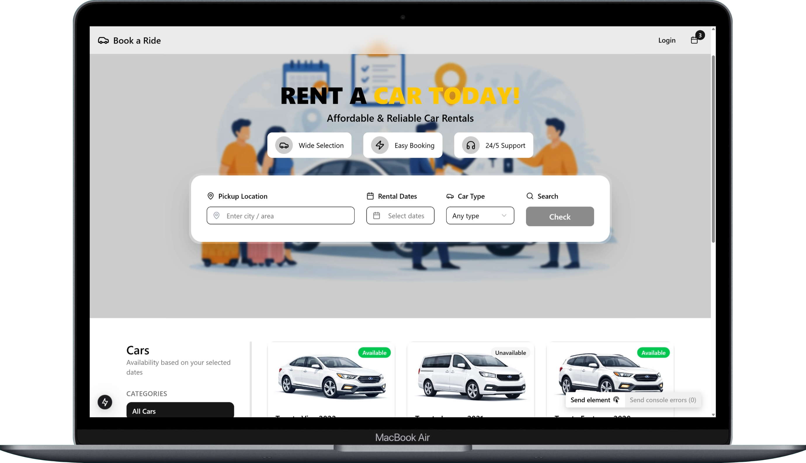
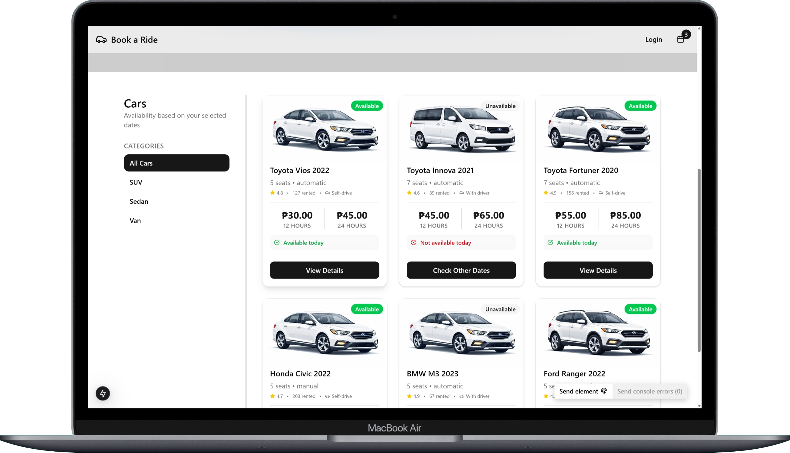
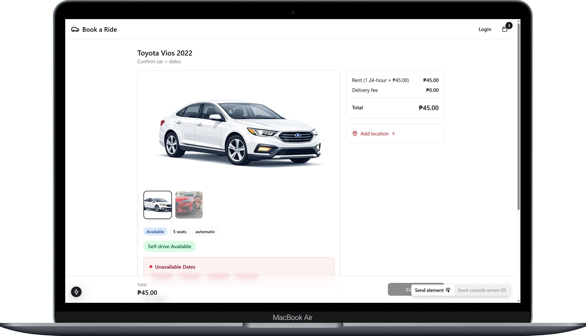

# 🚗 Car Rental Application



A modern car rental booking application built with Next.js 15, React, and TypeScript. Features a complete PSGC-based Philippine location selector system, real-time search, and seamless booking experience.

## 🌟 Key Features

### 📍 **Advanced Location Selector**
- **Complete Philippine Geographic Coverage**: Region → Province → City/Municipality → Barangay → Landmark
- **PSGC API Integration**: Uses official Philippine Standard Geographic Code data
- **Cascading Search**: Smart progressive disclosure of location fields
- **Real-time Autosuggestions**: Debounced API calls with instant results
- **Redux State Management**: Efficient caching and state handling

### 🚗 **Car Booking System**
- **Browse Available Cars**: Filter by location, dates, and preferences
- **Detailed Car Information**: Pricing, availability, specifications
- **Secure Booking Flow**: Multi-step checkout process
- **Fulfillment Management**: Pickup/dropoff coordination

### 🎨 **Modern UI/UX**
- **Responsive Design**: Works seamlessly on desktop and mobile
- **Component Library**: Built with shadcn/ui components
- **Smooth Animations**: Loading states and transitions
- **Accessibility**: Keyboard navigation and screen reader support

## 🛠️ Technology Stack

- **Frontend**: Next.js 15, React 18, TypeScript
- **Styling**: Tailwind CSS, shadcn/ui
- **State Management**: Redux Toolkit
- **API Integration**: PSGC (Philippine Standard Geographic Code)
- **Icons**: Lucide React
- **Build Tool**: Turbopack (Next.js 15)

## 📱 Screenshots

### Home Page - Location Search

*Main search interface with location selector and date picker*

### Location Modal - Cascading Selection

*Step-by-step location selection from region to barangay*

### Car Listings

*Available cars with filtering and search capabilities*

### Car Details

*Detailed car information and booking options*


## 🚀 Getting Started

### Prerequisites
- Node.js 18+ 
- npm or yarn

### Installation

1. **Clone the repository**
```bash
git clone <repository-url>
cd car_rentals_client
```

2. **Install dependencies**
```bash
npm install
# or
yarn install
```

3. **Set up environment variables**
```bash
cp .env.example .env.local
# Add any required API keys
```

4. **Run the development server**
```bash
npm run dev
# or
yarn dev
```

5. **Open your browser**
Navigate to [http://localhost:3000](http://localhost:3000)

## 📁 Project Structure

```
src/
├── app/                    # Next.js App Router
│   ├── cars/              # Car-related pages
│   ├── bookings/          # Booking management
│   └── layout.tsx         # Root layout
├── components/            # Reusable components
│   ├── location/          # Location selector components
│   ├── search/            # Search and filter components
│   ├── booking/           # Booking flow components
│   └── ui/               # Base UI components
├── hooks/                # Custom React hooks
│   ├── useReduxPSGCLocations.ts  # Location management
│   └── useGooglePlaces.ts         # Legacy Google Places
├── lib/                  # Utilities and configurations
│   ├── slices/           # Redux slices
│   ├── store.ts          # Redux store
│   └── types.ts          # TypeScript definitions
└── styles/               # Global styles
```

## 🌏 PSGC Location System

### API Endpoints Used
- **Regions**: `https://psgc.rootscratch.com/region`
- **Provinces**: `https://psgc.rootscratch.com/province?id={region_psgc_id}`
- **Cities**: `https://psgc.rootscratch.com/municipal-city?id={province_psgc_id}`
- **Barangays**: `https://psgc.rootscratch.com/barangay?id={city_psgc_id}`

### Location Selection Flow
1. **Region Selection** - Choose from 17 Philippine regions
2. **Province Selection** - Filtered provinces within selected region
3. **City/Municipality Selection** - Cities/municipalities within selected province
4. **Barangay Selection** - Barangays within selected city/municipality
5. **Landmark (Optional)** - Additional location reference point

### State Management
```typescript
// Redux state structure
interface LocationState {
  selectedRegion: PSGCRegion | null;
  selectedProvince: PSGCProvince | null;
  selectedCity: PSGCCity | null;
  selectedBarangay: PSGCBarangay | null;
  isLoading: boolean;
  error: string | null;
}
```

## 🔧 Configuration

### Environment Variables
```env
# Optional: Google Places API (if needed as fallback)
NEXT_PUBLIC_GOOGLE_PLACES_API_KEY=your_api_key_here
```

### Redux Store Configuration
The application uses Redux Toolkit for state management with the following slices:
- `regionsSlice`: PSGC regions data and caching
- Location state managed through `useReduxPSGCLocations` hook

## 🎯 Key Components

### LocationModal
Complete cascading location selector with:
- Progressive field disclosure
- Real-time validation
- Keyboard navigation
- Loading states
- Error handling

### ReduxLocationSearchInput
Compact location input with:
- Autosuggestions
- Client-side filtering
- Debounced API calls
- Accessibility features

### CarCard
Car listing component with:
- Image gallery
- Pricing display
- Quick booking actions
- Availability status

## 🧪 Testing

```bash
# Run type checking
npm run type-check

# Run linting
npm run lint

# Build for production
npm run build
```

## 🚀 Deployment

### Vercel (Recommended)
1. Push your code to GitHub
2. Connect your repository to Vercel
3. Deploy automatically

### Other Platforms
```bash
# Build the application
npm run build

# Start production server
npm start
```

## 🤝 Contributing

1. Fork the repository
2. Create a feature branch
3. Make your changes
4. Add tests if applicable
5. Submit a pull request

## 📄 License

This project is licensed under the MIT License.

## 🔗 Related Projects

- [PSGC API Documentation](https://psgc.rootscratch.com/)
- [Next.js Documentation](https://nextjs.org/docs)
- [Redux Toolkit](https://redux-toolkit.js.org/)
- [shadcn/ui](https://ui.shadcn.com/)

## 📞 Support

For questions or support, please open an issue in the repository.

---

**Built with ❤️ for the Philippine market** 🇵🇭
